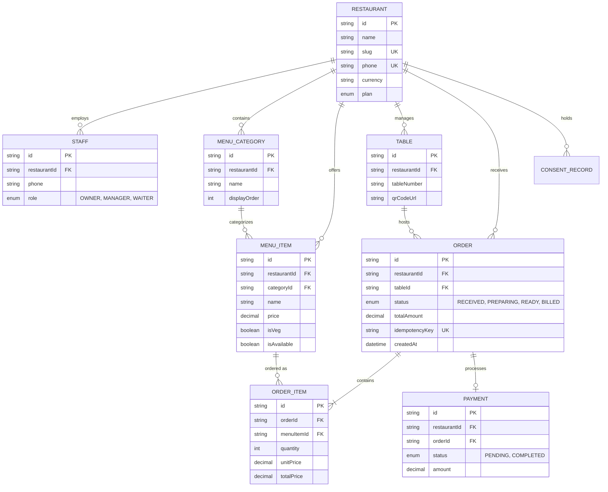

# OrderMitra Database Schema Diagram

Below is the Entity Relationship (ER) Diagram for the OrderMitra platform (Phase 1). This diagram represents the core transactional database structure.

```mermaid
erDiagram
    RESTAURANT ||--o{ STAFF : employs
    RESTAURANT ||--o{ MENU_CATEGORY : contains
    RESTAURANT ||--o{ MENU_ITEM : offers
    RESTAURANT ||--o{ TABLE : manages
    RESTAURANT ||--o{ ORDER : receives
    RESTAURANT ||--o{ CONSENT_RECORD : holds
    
    MENU_CATEGORY ||--o{ MENU_ITEM : categorizes
    
    TABLE ||--o{ ORDER : hosts
    
    ORDER ||--|{ ORDER_ITEM : contains
    ORDER ||--o| PAYMENT : processes
    
    MENU_ITEM ||--o{ ORDER_ITEM : "ordered as"

    RESTAURANT {
        string id PK
        string name
        string slug UK
        string phone UK
        string currency
        enum plan
    }

    STAFF {
        string id PK
        string restaurantId FK
        string phone
        enum role "OWNER, MANAGER, WAITER"
    }

    MENU_CATEGORY {
        string id PK
        string restaurantId FK
        string name
        int displayOrder
    }

    MENU_ITEM {
        string id PK
        string restaurantId FK
        string categoryId FK
        string name
        decimal price
        boolean isVeg
        boolean isAvailable
    }

    TABLE {
        string id PK
        string restaurantId FK
        string tableNumber
        string qrCodeUrl
    }

    ORDER {
        string id PK
        string restaurantId FK
        string tableId FK
        enum status "RECEIVED, PREPARING, READY, BILLED"
        decimal totalAmount
        string idempotencyKey UK
        datetime createdAt
    }

    ORDER_ITEM {
        string id PK
        string orderId FK
        string menuItemId FK
        int quantity
        decimal unitPrice
        decimal totalPrice
    }

    PAYMENT {
        string id PK
        string restaurantId FK
        string orderId FK
        enum status "PENDING, COMPLETED"
        decimal amount
    }
```
