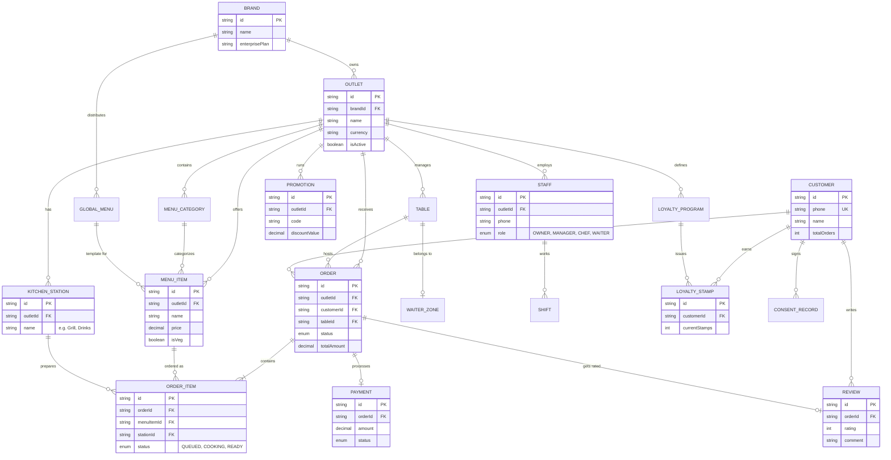

# OrderMitra Full Database Schema (Phases 1-5)

Below is the complete Entity Relationship (ER) Diagram for the entire OrderMitra platform vision, including Loyalty, Reviews, Enterprise Branding, and Kitchen Displays.

